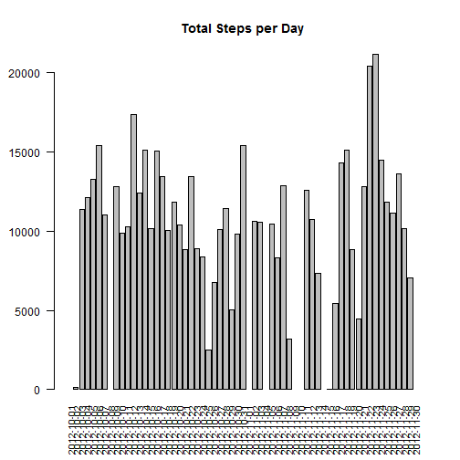

Reproducible Research: Peer Assessment #1
========================================================

## Loading and preprocessing the data
* Dataset: [Activity Monitoring Data](https://d396qusza40orc.cloudfront.net/repdata%2Fdata%2Factivity.zip)
* We can download, unzip, load the data into R and do some preprocessing.

```r
url <- "http://d396qusza40orc.cloudfront.net/repdata%2Fdata%2Factivity.zip"
download.file(url, destfile="repdata-data-activity.zip")
unzip("repdata-data-activity.zip")
activity_data <- read.csv("activity.csv")
## Add a column for day of the week
activity_data$day <- weekdays(as.Date(activity_data$date))
```
## What is the mean total number of steps taken per day?
* To get a histogram of the steps taken each day

```r
library(plyr)
## Summarize Steps By Date
date_steps <- ddply(activity_data, .(date), summarize, steps_total=sum(steps))
## Create Histogram
barplot(date_steps$steps_total, main="Total Steps per Day", las=2,
        names.arg=date_steps$date, cex.names=0.8)
```

 
* To get the mean and median total steps per day

```r
mean(date_steps$steps_total, na.rm=TRUE)
```

```
## [1] 10766.19
```

```r
median(date_steps$steps_total, na.rm=TRUE)
```

```
## [1] 10765
```
## What is the average daily activity pattern?
* Computer and plot the average number of steps taken during each interval

```r
interval <- ddply(activity_data, .(interval), summarize, mean_steps=mean(steps, na.rm=TRUE))
plot(interval$interval, interval$mean_steps, type="l", xlab="Interval", ylab="Mean # of Steps")
```

 
* Find which interval contains the maximum number of steps

```r
interval_total <- ddply(activity_data, .(interval), summarize, tot_steps=sum(steps, na.rm=TRUE))
max_interval <- arrange(interval_total, desc(tot_steps))
print(max_interval[1,])
```

```
##   interval tot_steps
## 1      835     10927
```
## Imputing missing values
* How many rows in the dataset having missing values

```r
ok <- complete.cases(activity_data) ## Find complete cases
sum(!ok) ## Show the total of incomplete cases
```

```
## [1] 2304
```
* I decided to replace any NA's with the mean value of that interval

```r
new_data <- activity_data ## Create new dataset
## Create a function that computes a mean
impute_mean <- function(x) replace(x, is.na(x), mean(x, na.rm=TRUE))
## Implement the function on the dataset
new_data <- ddply(new_data, ~ interval, transform, steps=impute_mean(steps))
```
* Now we can compare against our original data

```r
## Summarize Steps By Date
date_steps <- ddply(new_data, .(date), summarize, steps_total=sum(steps))
## Create Histogram
barplot(date_steps$steps_total, main="Total Steps per Day", las=2,
        names.arg=date_steps$date, cex.names=0.8)
```

 

```r
mean(date_steps$steps_total, na.rm=TRUE)
```

```
## [1] 10766.19
```

```r
median(date_steps$steps_total, na.rm=TRUE)
```

```
## [1] 10766.19
```
## Are there differences in activity patterns between weekdays and weekends?
* Lets cut the data between weekends and weekdays

```r
library(openair)
```

```
## Warning: package 'openair' was built under R version 3.1.2
```

```r
new_data$date <- as.Date(new_data$date)
weekend <- cutData(new_data, type="weekend")
weekend_split <- ddply(weekend, .(weekend, interval), summarize, steps=mean(steps))
```
* Next we can plot the data

```r
library(lattice)
xyplot(steps ~ interval|weekend, data=weekend_split, type='b')
```

 
